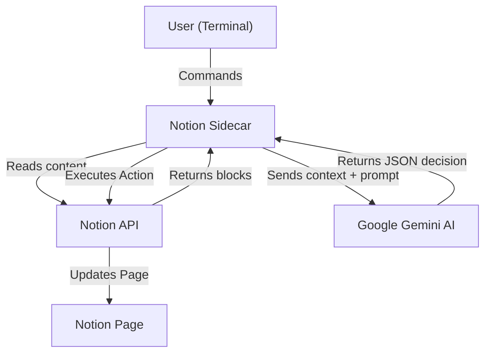

# Notion Sidecar

[](https://opensource.org/licenses/MIT)
[](https://www.python.org/downloads/)
[](https://github.com/psf/black)
[](https://github.com/astral-sh/ruff)
[](http://makeapullrequest.com)

**Notion Sidecar** is an autonomous AI agent capable of editing Notion blog posts via terminal commands. Powered by Google Gemini, it interprets natural language instructions to update, append, and refine content programmatically.

> **Status:** Alpha. Under active development.

## Features

- **Natural Language Editing**: Interpret commands such as "Rewrite the intro to be more concise" or "Add a summary conclusion."
- **Real-time Synchronization**: Updates are reflected immediately in the Notion workspace.
- **Context Awareness**: Analyzes existing content to understand context before executing changes.
- **Security**: Operates locally with API keys stored securely in environment variables.
- **Cross-Platform Compatibility**: Supported on macOS, Linux, and Windows (via WSL).

## Architecture



## Quick Start

### Prerequisites

- Python 3.10 or higher
- A Notion Integration Token ([Create one here](https://www.notion.so/my-integrations))
- A Google Gemini API Key ([Get one here](https://aistudio.google.com/app/apikey))
- The ID of the Notion page to monitor

### Installation

1. **Clone the repository**
   ```bash
   git clone https://github.com/umutyildiz/notion-sidecar.git
   cd notion-sidecar
   ```

2. **Set up a virtual environment**
   ```bash
   python3 -m venv venv
   source venv/bin/activate  # On Windows: venv\Scripts\activate
   ```

3. **Install dependencies**
   ```bash
   pip install -r requirements.txt
   ```

   *If you encounter an "externally managed environment" error, ensure your virtual environment is active or try:*
   ```bash
   venv/bin/pip install -r requirements.txt
   ```

4. **Configure environment**
   ```bash
   cp .env.template .env
   ```
   Edit `.env` to include your API keys and Page ID.

### Usage

Execute the agent (ensure you are in the root directory):
```bash
python3 -m src.agent
```

*Or if your virtual environment isn't activated:*
```bash
venv/bin/python -m src.agent
```

**Example Session:**

```text
Notion Editor Agent Activated...
---------------------------------------

Command: "Rewrite the introduction paragraph in a more professional tone."
Scanning sections...
Processing...
Updating block: Hello friends, t...
Success: Changes applied to Notion.

Command: "Add a bibliography at the end."
Appending to document...
Success: Append operation completed.
```

## Contributing

Contributions allow the open source community to learn, inspire, and create. Any contributions are **greatly appreciated**.

Please review [CONTRIBUTING.md](CONTRIBUTING.md) for details on the code of conduct and the pull request process.

## Security

For security concerns, please refer to the [Security Policy](SECURITY.md).

## License

Distributed under the MIT License. See `LICENSE` for more information.
